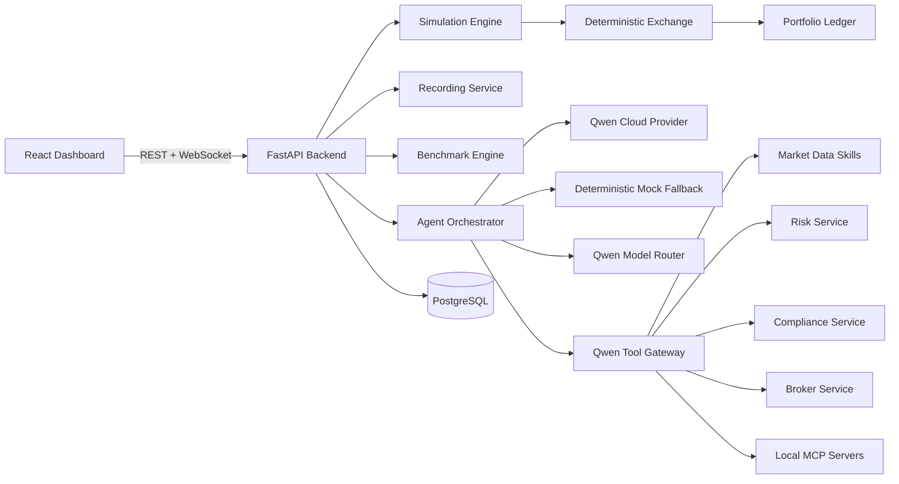

# Agentic Hedge Fund

**A Qwen Cloud Agent Society that runs a simulated hedge-fund trading desk.**

Agentic Hedge Fund is a replay-first market simulation where specialized Qwen agents decompose a trading day, debate catalysts, route a basket through portfolio/risk/compliance/committee gates, execute simulated fills, and benchmark the agent society against a required `single_agent` baseline.

This is a simulation and education project only. It does not connect to a real brokerage, does not execute real trades, and does not provide investment advice.

## Hackathon Track

Qwen Cloud Global AI Hackathon - **Track 3: Agent Society**.

The project is built around the Agent Society track requirements:

- Distinct agents with separate responsibilities: coordinator, macro analyst, technical analyst, sentiment analyst, bull researcher, bear researcher, research manager, portfolio manager, risk manager, compliance officer, investment committee chair, execution trader, and operations monitor.
- Task division and collaboration: a portfolio slate is ranked across tickers, specialists inspect different evidence, researchers debate, and the committee resolves conflicts.
- Explicit dialogue and negotiation: bull/bear arguments, reliability-weighted consensus, risk/compliance objections, and committee outcomes are stored in the replay.
- Measurable gain over a single agent: the benchmark card shows `multi_agent` vs `single_agent` side by side with ASAI, return, drawdown, risk violations, directional accuracy, and decision quality.
- Qwen Cloud usage: Qwen structured output, Qwen-compatible tool calling, typed JSON schemas, model routing, and `/api/proof/qwen`.

## What The Demo Shows

- A dark dockable trading cockpit with market replay candles, order book, portfolio, and optional agent/governance panels.
- A bundled full-day replay named **`Example Full Day Simulation 11th June 2025`** so reviewers can open a realistic saved run immediately after cloning.
- Qwen agents evaluating up to 10 tickers as a portfolio slate, not a single isolated symbol.
- Evidence-led allocation roles: primary catalyst, hedge candidate, relative-value candidate, and watchlist/hold reasons.
- Simulated long/short marketable IOC fills through a deterministic order book and ledger.
- Agent chat details with formatted structured JSON, tool calls, validation notes, and state transitions.
- Replay keyframes for fast loading of full-day recordings.
- Agent Society benchmark proof: `multi_agent` vs `single_agent`.

## Architecture



The agents do not mutate financial state directly. They can propose and explain actions, but the deterministic broker, exchange, risk, compliance, and ledger services own the state transitions.

## Repository Layout

```text
apps/api/                         FastAPI backend, agents, simulation, recordings
apps/api/app/agents/qwen_client.py Qwen Cloud structured-output client
apps/api/app/skills/              Permissioned tool gateway and MCP adapters
apps/api/app/services/            Exchange, ledger, risk, compliance, recordings
apps/api/app/recording_fixtures/  Bundled replay fixture seeded on startup
apps/web/                         React/Vite dashboard
configs/                          Local MCP and risk-limit defaults
docs/                             Architecture, proof, deployment, demo, benchmarking
```

## Quickstart

```bash
cp .env.example .env
docker compose up --build
```

Open:

- Dashboard: http://localhost:5173
- API health: http://localhost:8000/health
- Qwen proof: http://localhost:8000/api/proof/qwen
- MCP status: http://localhost:8000/api/mcp/status

On startup, the API seeds the bundled replay fixture into `SIMULATION_RECORDINGS_DIR` if it is missing. Runtime-created recordings remain ignored by git.

## Qwen Cloud Setup

Set your Qwen Cloud DashScope key in `.env`:

```bash
DASHSCOPE_API_KEY=your_dashscope_key_here
QWEN_BASE_URL=https://dashscope-intl.aliyuncs.com/compatible-mode/v1
QWEN_MODEL_REASONING=qwen3.7-plus
QWEN_MODEL_FAST=qwen3.7-flash
QWEN_MODEL_CODER=qwen3-coder-plus
QWEN_JSON_MODE=true
QWEN_STRUCTURED_OUTPUT_STRATEGY=json_object
QWEN_ENABLE_THINKING=false
MAX_QWEN_CALLS_PER_CYCLE=12
MAX_QWEN_TOOL_CALLS_PER_AGENT=6
MAX_PARALLEL_AGENT_CALLS=5
```

Provider resolution is intentionally simple for submission clarity:

1. If `DASHSCOPE_API_KEY` is present, the backend uses Qwen Cloud.
2. If no Qwen key is present, the backend uses deterministic mock agents for offline tests and demo resilience.

There is no other real model provider path. Keys stay server-side and are not sent to the frontend or saved into replay files.

## Bundled Replay

The curated replay is:

```text
Example Full Day Simulation 11th June 2025
```

Fixture location:

```text
apps/api/app/recording_fixtures/example-full-day-simulation-2025-06-11/
```

The large frame file is committed as compressed chunks:

```text
frames.ndjson.gz.part001
frames.ndjson.gz.part002
```

At API startup, `app.scripts.seed` reconstructs the runtime `frames.ndjson` sidecar inside `SIMULATION_RECORDINGS_DIR`. This keeps the GitHub repository focused on one curated replay while leaving user-generated recordings ignored:

```text
recordings/
apps/api/recordings/
```

To demo it:

1. Start the app with Docker.
2. Open the dashboard.
3. Open **Simulations**.
4. Select **Example Full Day Simulation 11th June 2025**.
5. Replay using action/keyframes for fast loading.
6. Run the benchmark panel to show `multi_agent` vs `single_agent`, or use the benchmark already saved in the final replay snapshot.

## Agent Society Flow

1. **CoordinatorAgent** assigns the portfolio slate and tasks.
2. **MacroAnalystAgent**, **TechnicalAnalystAgent**, and **SentimentNewsAnalystAgent** review point-in-time context.
3. **BullResearcherAgent** and **BearResearcherAgent** debate catalyst quality and downside risk.
4. **ResearchManagerAgent** computes consensus, disagreement, and candidate ranking.
5. **PortfolioManagerAgent** proposes up to three evidence-led trades: primary, hedge, or relative value.
6. **RiskManagerAgent** resizes or rejects proposals using exposure, volatility, depth, and per-name limits.
7. **ComplianceOfficerAgent** blocks future-data leakage, irrelevant evidence, and restricted conditions.
8. **InvestmentCommitteeChairAgent** resolves disagreements and approves, resizes, defers, or rejects.
9. **ExecutionTraderAgent** routes simulated marketable IOC child orders into the deterministic exchange.
10. **PortfolioLedger** updates cash, positions, realized PnL, unrealized PnL, and exposure.

## Benchmark Proof

The Benchmark panel is intentionally explicit for Track 3:

```text
multi_agent vs single_agent
```

It reports:

- Total return
- Max drawdown
- Risk violations
- Directional accuracy
- Decision quality
- ASAI, the Agent Society Advantage Index

The replay benchmark endpoint scores keyframes only, so a full-day recording can be benchmarked quickly:

```text
POST /api/recordings/{recording_id}/benchmark
```

Live simulations can be benchmarked directly:

```text
POST /api/simulations/{simulation_id}/benchmark
```

The benchmark is deterministic and does not call Qwen. It compares the saved multi-agent outcome against a single-agent baseline and other deterministic baselines.

## Hackathon Evaluation Mapping

| Criterion | Implementation |
|---|---|
| Technical Depth and Engineering | FastAPI, React, WebSockets, Docker, PostgreSQL, Alembic, typed Pydantic schemas, replay storage, keyframes, tests, metrics. |
| Innovation and AI Creativity | Qwen agent society, explicit debate, evidence-led basket allocation, risk/compliance governance, ASAI, replayable market lab. |
| Problem Value and Impact | Demonstrates how financial agent teams can be audited, constrained, benchmarked, and replayed without real-money risk. |
| Presentation and Documentation | Bundled full-day replay, dark trading cockpit, architecture diagram, Qwen proof endpoint, Alibaba deployment proof guide, demo script. |

## Devpost Submission Checklist

- Track: **Agent Society**.
- Public repository URL.
- Open-source license visible: `LICENSE`.
- Architecture diagram: this README and `docs/ARCHITECTURE.md`.
- Main public demo video, about three minutes.
- Separate Alibaba Cloud deployment proof recording.
- Alibaba proof instructions: `docs/ALIBABA_CLOUD_PROOF.md`.
- Qwen proof endpoint: `/api/proof/qwen`.
- Benchmark proof: dashboard Benchmark panel showing `multi_agent` and `single_agent`.
- Text description of features and functionality.
- Optional blog/social post for the Blog Post Prize.

## Alibaba Cloud Proof

Recommended proof clip:

1. Show Alibaba Cloud/ECS console or terminal.
2. Run `docker compose ps`.
3. Open `/health`.
4. Open the dashboard connected to the deployed backend.
5. Open `/api/proof/qwen`.
6. Open the bundled full-day replay.
7. Run or show the Agent Society benchmark.

See `docs/ALIBABA_CLOUD_PROOF.md`.

## Local Development

```bash
make setup
make dev
make seed
make test
make lint
make benchmark
make mcp-smoke
```

Useful direct checks:

```bash
cd apps/api
python -m pytest
python -m ruff check app
python -m mypy app

cd apps/web
npm test -- --run
npm run typecheck
npm run lint
npm run build
```

## Actual Market Data

The launcher can import historical bars for manually entered stock tickers, then generate a deterministic replayable limit-order book from those bars. yfinance is the default no-key provider; Alpaca remains optional:

```bash
MARKET_DATA_MODE=synthetic
REAL_MARKET_TICKERS=AAPL,NVDA,MSFT,TSLA,AMD,AMZN,META,GOOGL,JPM,XOM
YFINANCE_INTERVAL=1m
YFINANCE_LOOKBACK_PERIOD=5d
ALPACA_API_KEY_ID=
ALPACA_API_SECRET_KEY=
ALPACA_DATA_FEED=iex
```

Older dates may use daily OHLCV as an anchor for deterministic intraday-shaped replay when 1-minute bars are unavailable. Order-book depth is simulated for replay consistency; it is not a live consolidated Level 2 feed.

## Safety

- Simulated trades only.
- No real brokerage execution.
- No investment advice.
- Qwen/API keys remain backend-only.
- Replays are redacted before being saved or served publicly.
- Future-data leakage checks prevent agents from seeing unreleased events.

## License

MIT. See `LICENSE`.
