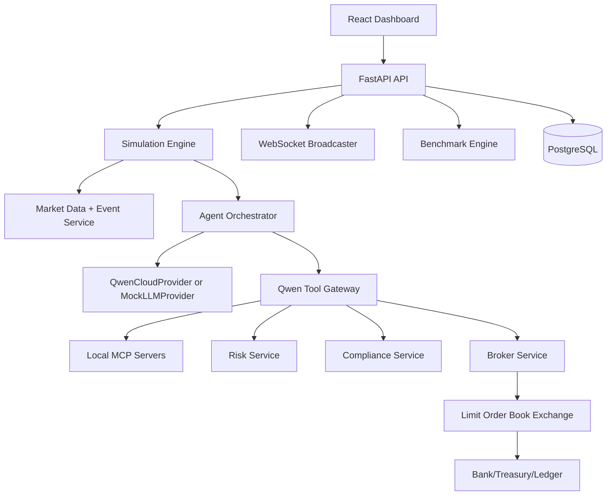

# Architecture

Agentic Hedge Fund is a simulation-only multi-agent market-risk lab.

## Service Boundaries

- Agents propose, debate, and explain.
- Risk, compliance, broker, exchange, and ledger services enforce state.
- Provider output is validated before it influences simulated orders.
- The frontend receives only API and WebSocket data, never secrets.

## Determinism

Mock mode is deterministic for tests and demos. Synthetic data is generated from scenario seeds. Agents only receive current and historical bars/events.
