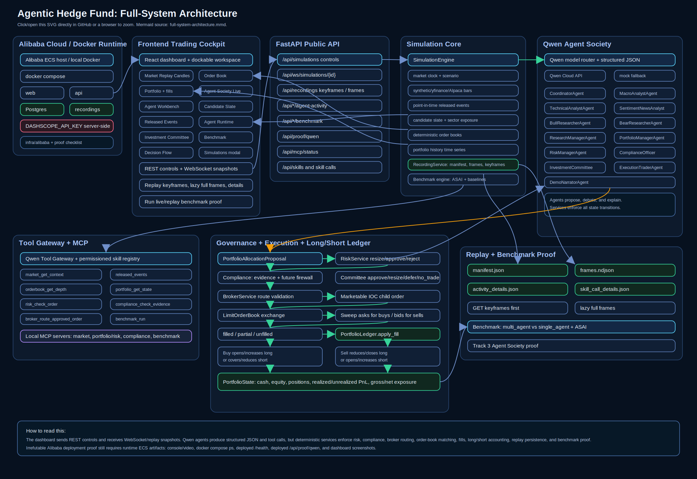
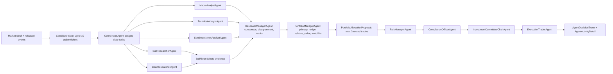
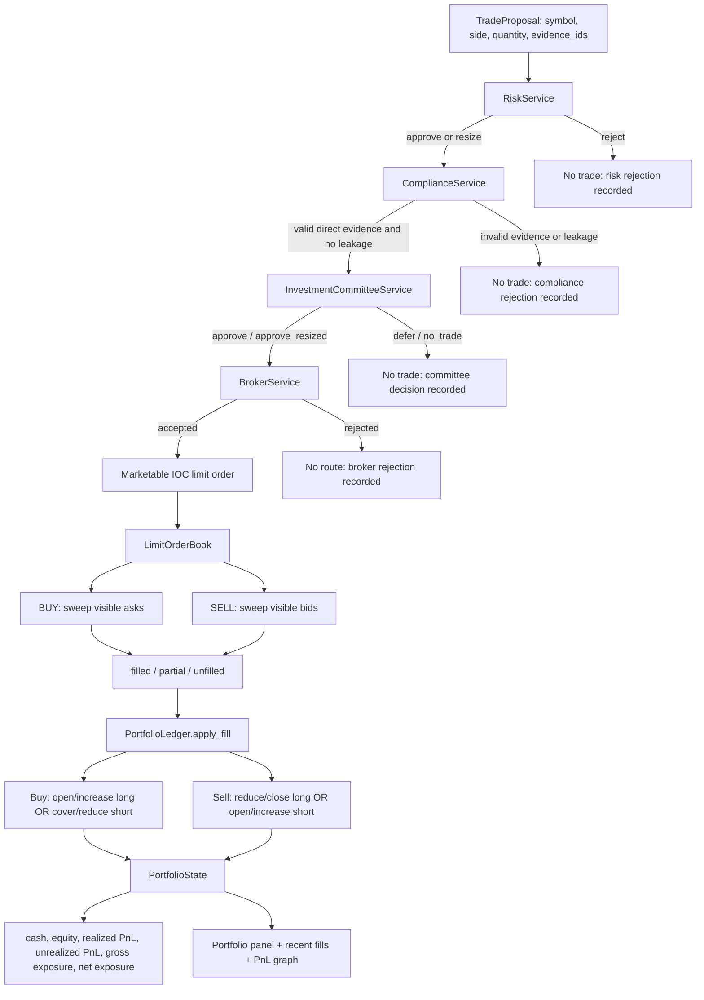
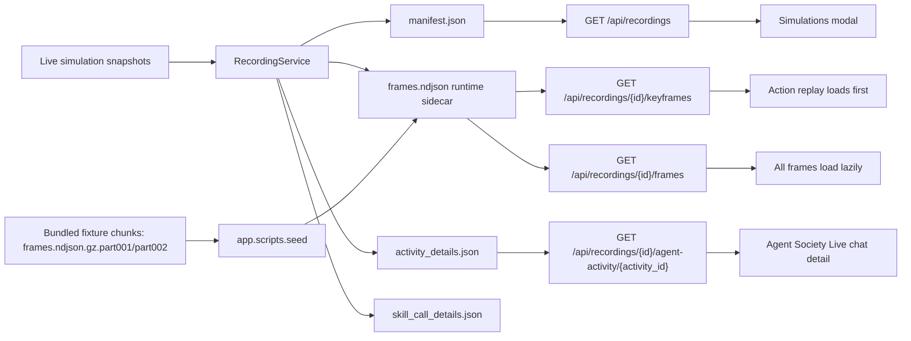
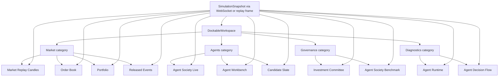
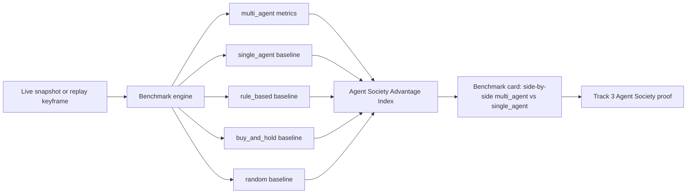

# Architecture

Agentic Hedge Fund is a replay-first Qwen Agent Society and simulated hedge-fund trading desk. The system links a dockable dashboard, FastAPI control plane, Qwen structured-output agents, permissioned tools, MCP servers, deterministic risk/compliance/broker/exchange services, saved full-day replays, and an explicit `multi_agent` vs `single_agent` benchmark.

## Zoomable Whole System Map

[Open full-size architecture diagram](assets/architecture/full-system-architecture.svg)

GitHub squeezes very large inline Mermaid diagrams into the Markdown column. The SVG above is the readable zoomable version, and the editable Mermaid source lives at `docs/assets/architecture/full-system-architecture.mmd`.

## Agent Society Decision Cycle

Each agent returns validated structured JSON. The society can disagree, resize, defer, reject, or route simulated orders, but state changes only happen after deterministic service checks.

## Trade Execution, Fills, And Long/Short Accounting

Approved orders are not real trades. They are simulated IOC child orders matched against deterministic visible liquidity so the replay can show fills, partial fills, or unfilled outcomes.

## Replay, Recording, And Keyframe Loading

The bundled replay `Example Full Day Simulation 11th June 2025` is seeded into the Docker recording volume on startup if it is missing.

## Dashboard Dockable Workspace Data Flow

Only the core cockpit panels are visible by default; secondary panels can be added, removed, and repositioned without changing backend state.

## Benchmark And Agent Society Proof

Replay benchmarking scores keyframes only, so a full-day replay can show the required society-vs-single-agent comparison without loading every raw frame.

## Alibaba Cloud Proof Surface

Code and documentation evidence for deployment readiness lives in:

- `infra/alibaba/`
- `docker-compose.yml`
- `docs/ALIBABA_CLOUD_PROOF.md`
- `/health`
- `/api/proof/qwen`
- `/api/mcp/status`

Those files prove the deployment path and the proof checklist. Irrefutable deployment proof still requires runtime artifacts from Alibaba ECS, such as an ECS console recording, `docker compose ps`, deployed `/health`, deployed `/api/proof/qwen`, and dashboard screenshots or video from the deployed host.

## Service Boundaries

- Agents produce structured recommendations, debate records, and rationale.
- Risk, compliance, broker, exchange, and ledger services enforce state transitions.
- Qwen and tool outputs are validated before they can influence simulated orders.
- The frontend receives redacted API and WebSocket payloads, never secret keys.

## Determinism

Mock mode is deterministic for tests and offline demos. Synthetic depth and replay order books are generated from scenario/bars so saved recordings can be replayed consistently. Agents only receive point-in-time bars/events and never future unreleased events.
